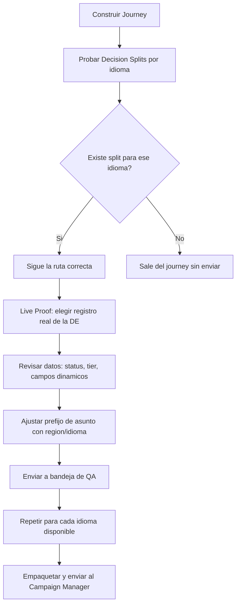
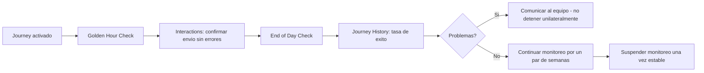
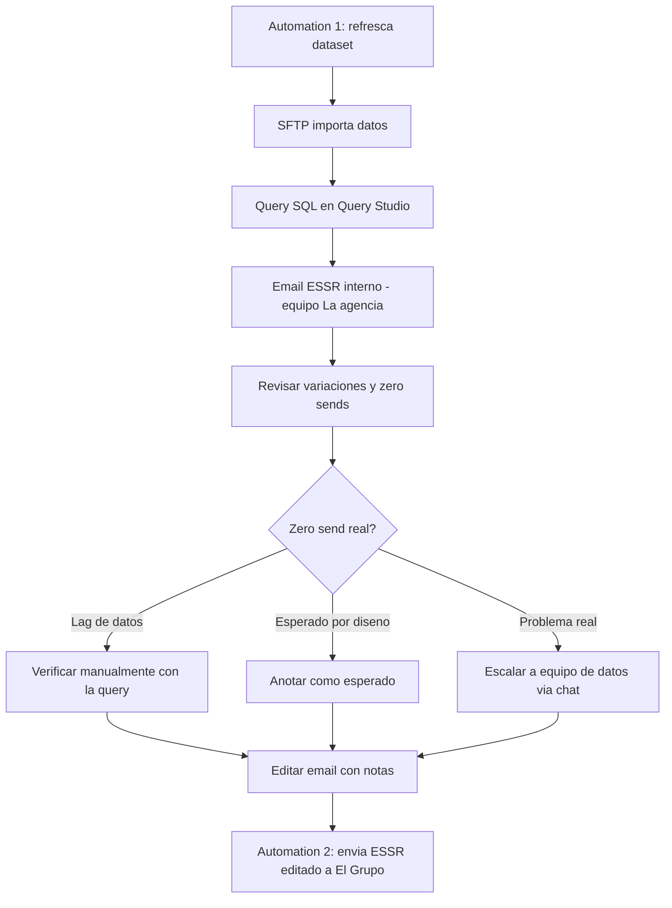

# LFC Training — Marketing Cloud Journey Monitoring & Reporting

> [!info]- 🔗 Enlaces entrantes
> ```dataview
> LIST
> FROM [[LFC_20260508_Marketing Cloud Journey Monitoring & Reporting]]
> WHERE file.path != this.file.path
> ```

> [!info] Sesión de capacitación LFC — 8 de mayo, 2026 Relacionado: [[LFC - QA Test Cases y Proofing Process]] · Índice: [[LFC Onboarding - Indice de Sesiones]]

## Resumen

Sesión dividida en dos partes: (1) cómo probar y monitorear un Journey en Marketing Cloud después de construirlo, y (2) el reporte diario ESSR que da seguimiento a los envíos de los journeys "always-on".

## 1. Journey Builder: prueba de Decision Splits

- El **Development Plan (DP)** documenta el propósito del journey, capturas de los decision splits, lógica de no-re-entry y el schedule — sirve de referencia y checklist para QA.
- El **campo "mailing date"** se refresca cada vez que corre la automatización; funciona como respaldo para confirmar que no se está enviando información desactualizada.
- Prueba de splits: se seleccionan registros de distintos idiomas (USEN, IT, JP, EUEN, MSEN/DE) desde la DE y se valida que cada uno siga la ruta correcta (o salga sin enviar si no existe split para ese idioma).



> [!tip] Journeys de prueba Conviene construir un journey de prueba apuntando a una DE de prueba (sin mailing date) para validar todos los splits antes de copiarlo y ajustarlo a producción.

## 2. Monitoreo post-envío



- **Golden Hour Check**: poco después del envío, revisar en Interactions que el journey esté corriendo sin errores; captura de pantalla para el campaign manager.
- **End of Day Check**: más tarde, revisar Journey History (tasa de éxito, completado); otra captura como evidencia.
- Solo se detiene un journey si el problema es de **contenido**; los problemas de **datos** suelen fallar por sí solos y no requieren detener el envío.

## 3. ESSR — Email Send Summary Report

- Reporte diario (llega ~2 veces al día) que resume los envíos de los últimos 7 días para una lista curada de journeys **always-on** (no incluye campañas temporales/esporádicas como nurture Q4).
- **Formato condicional**: naranja = caída >25% vs. misma fecha semana anterior; morado = incremento >25%. Los **"zero sends"** se consideran más críticos que las variaciones porcentuales y tienen su propia tabla.



- Muchos "zero sends" son falsos positivos por **desfase de actualización de datos** (el reporte corre antes de que ciertos envíos ocurran) — se verifica corriendo la query manualmente contra la DE real.
- Los problemas reales de datos se escalan al equipo de datos (Ranik) por un chat de grupo (Kamariya, Anu, Ranik) — nunca se contacta directo al marketing manager, para evitar alarmas innecesarias.
- La query y su documentación (referida como "la Biblia del proyecto") solo se edita para agregar/quitar journeys de la lista o actualizar convenciones de nombres de email.
- La **lista de distribución** del reporte se actualiza cuando cambian los stakeholders (se depuró en vivo durante la sesión, agregando a Oscar y Tamara).

## Plan de transición

- Anu maneja el ESSR actualmente.
- Se acordó iniciar con ~1 semana de "shadowing" antes de que Oscar tome el proceso, seguido de check-ins diarios breves (5–10 min) hasta operar de forma independiente.

## Glosario rápido

- **ESSR**: Email Send Summary Report.
- **Golden Hour Check**: verificación temprana de que el journey empezó a enviar sin errores.
- **End of Day Check**: verificación al final del día de la tasa de éxito del envío.
- **Query Studio**: herramienta para correr manualmente la consulta SQL y verificar datos reales.

## Preguntas abiertas / seguimiento

- [ ] Depurar journeys transaccionales de la lista de monitoreo del ESSR.
- [ ] Confirmar acceso de Oscar y Tamara al SharePoint / documento fuente del ESSR.
- [ ] Definir fecha exacta de inicio de la transición Anu → Oscar.